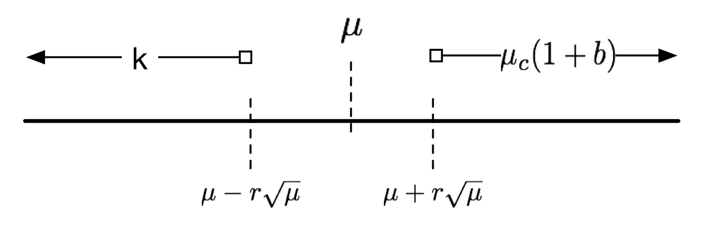

% Advanced Algorithms and Data Structures
% Assignment 2
% Bjarki Madsen (lch929) - Michael Bang (tqg432)

\pagebreak

# Exercise 1 (a)

If $p \geq 100/m$ for some very large $m$, we want to show that:

$$ p \leq Pr[h_{m}(x) / m < p] < 1.01p $$

Looking at the probability , we observe the following:

$$Pr[h_{m}(x) / m < p] = Pr[h_{m}(x) < mp ] = Pr[h_m(x) < \lceil mp \rceil] = Pr[h_m(x) < \lfloor mp \rfloor + 1]$$

Where we used that $\lceil mp \rceil \ge mp$, and that $\lceil mp \rceil = \lfloor mp \rfloor+1$

This allows us to show the left side of our initial equation:

\begin{align*}
    \frac{\lceil mp \rceil}{p} \geq \frac{mp}{p} = p \implies
    p \le Pr[h_m(x)/m < p]
\end{align*}

As well as the right side:

\begin{align*}
    \frac{\lfloor mp \rfloor+1}{m} \le \frac{mp+1}{m} = p + \frac{1}{m} \le 1.01p
\end{align*}

In the equation above we used the fact that $m$ is large, meaning that $1/m$ is very small.

# Exercise 1 (b)

Let $h(x) = h_m(x)/m$ where $h(x)$ is a universal hash function. Let $x, y \in A \subseteq U,\ x \ne y$. The definition of a universal hash function then tells us that the that we have the following low collision probability $Pr[h(x)=y(x)] \le 1/m$.

We know that $m \ge 100|A|^2$, so $Pr[h(x)=h(y)] \le \frac{1}{100|A|^2}$

# Exercise 2

Since $S$ is uniformly distributed in A, $\frac{|S^k_h(A)|}{|A|}$ is the expected fraction of elements from $S$ to be found in any subset of $A$. In addition, since $C$ is a subset of $A$, we expect the same ratio, $\frac{k}{n}$, elements of $C$ to also be in $S$. We therefore write:

$$ \frac{k}{n} = \frac{|S^k_h(A)|}{|A|} = E[\frac{|C \cap S^k_h(A)|}{|C|}] \Rightarrow \frac{k}{|A|} = \frac{E[|C \cap S^k_h(A)|]}{|C|}$$

since $|S^k_h(A)| = k$ and $|C|$ is a constant which can be taken out of the expectation. We then multiply $\frac{|C|}{k}$ on both sides which gives:

$$ \frac{|C|}{|A|} = \frac{E[|C \cap S^k_h(A)|]}{k} $$

# Exercise 3 (a)

Fibonacci min-heap

# Exercise 3 (b)

$O(1)$

# Exercise 4 (a)

It's immediately clear that the set of the $k$ lowest elements of the set $A \cup B$ must be contained in the union of the $k$ lowest elements from each of the sets, $S^k_h(A \cup B) \in S^k_h(A) \cup S^k_h(B)$.

Taking the lowest $k$ elements from the set $S^k_h(A) \cup S^k_h(B)$ of $2k$ elements must yield the $k$ minimum elements of the set $A \cup B$, meaning that $S^k_h(A \cup B) = S^k_h(S^k_h(A) \cup S^k_h(B))$.

# Exercise 4 (b)

# Exercise 4 (c)

Because the sets are sorted, and each are of size $k$, we can find their intersection in time linear to $k$ by iteratively progressing through the sorted lists, picking the items which are equal. We can perform the calculation in $O(k)$.

# Exercise 5

We will use contradiction to prove that $(I) \lor (II) \implies (4)$.

First we assume $\lnot (II)$:

\begin{align*}
    |S_{h,p}(C)| \le (1+b)p|C| &\implies\\
    |S_{h,p}(C)| \le (1+b)\frac{k}{n(1-a)}|C| &\implies\\
    |S_{h,p}(C)| \le \frac{1+b}{1-a}kf
\end{align*}

Then we assume that $(4)$ is true:

\begin{align*}
    \frac{1+b}{1-a}kf < |C \cap S|\\
    \text{using } \lnot (II) &\implies\\
    |S_{h,p}(C)| < |C \cap S|\\
    \text{we know that } |C \cap S| \le k &\implies\\
    |S_{h,p}(C)| < |C \cap S| \le k
\end{align*}

Now we assume $\lnot(I)$:
\begin{align*}
    k le |S_{h,p}(A)|\\
    \text{let } C = A, \text{ and use } (4)\\
    |S_{h,p}(C)| < k \le |S_{h,p}(A)\\
    \text{but } C = A\text{, so}\\
    |S_{h,p}(A)| < |S_{h,p}(A)
\end{align*}

Which obviously is a contradiction.

The above implies that either $(I)$ or $(II)$ must be true in order for $(4)$ to be true.

# Exercise 6

We want to prove that the probability of $|S_{h,p}(A)| < k$ has an upper bound of $1 / r^2$ by using Lemma 1. As Figure \ref{fig:e_6_7_line} shows, it would be sufficient to show that $k < \mu - r\sqrt{\mu}$ since:

$$ Pr[|X - \mu| \geq r\sqrt{\mu}] \leq 1/r^2 $$

Having shown that, it's clear that $P_{(I)}$ is also less than $1 / r^2$.

We have:

$$ $$

# Exercise 7
